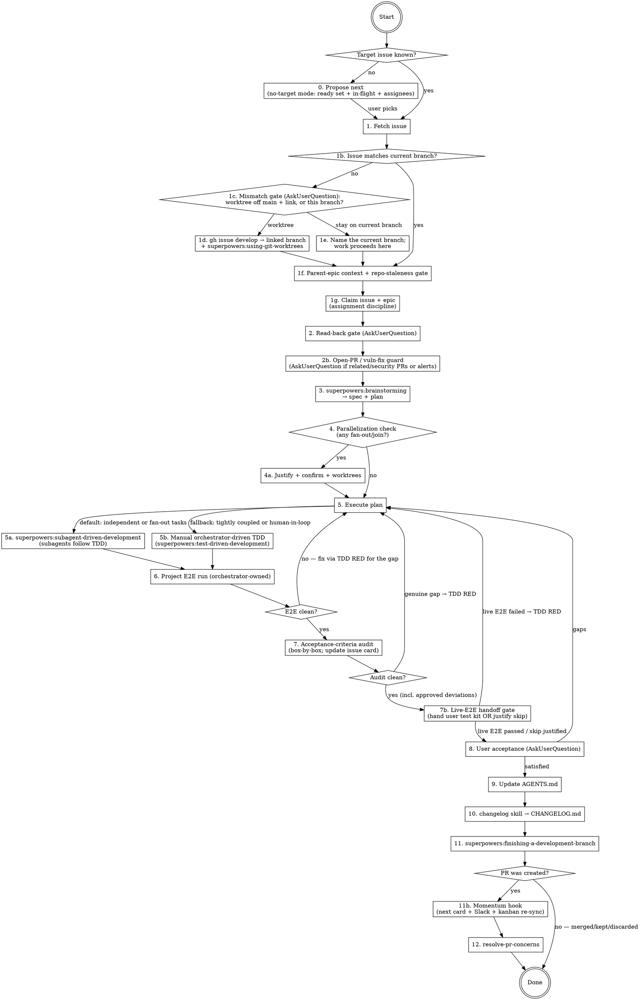

# Build From Issue

## Overview

Orchestrator skill for taking a GitHub issue (typically brief) all the way to a PR-ready feature. This skill owns the issue-specific glue (issue fetch, read-back, E2E run, acceptance-criteria audit, user acceptance, agent-doc + changelog updates, PR follow-up) and **delegates everything else to specialized superpowers skills**. Do not duplicate the delegated mechanics inline.

**Delegations:**
- Spec + plan creation → `superpowers:brainstorming` (which itself terminates by invoking `superpowers:writing-plans`)
- Per-task implementation discipline → `superpowers:test-driven-development` (red-green-refactor, iron law, verify-RED, verify-GREEN)
- Plan execution + per-task code review → `superpowers:subagent-driven-development` (default) or orchestrator-driven manual TDD (fallback)
- Optional parallelization isolation → `superpowers:using-git-worktrees`
- Branch finalization (merge / PR / keep / discard, worktree cleanup) → `superpowers:finishing-a-development-branch`
- PR-side follow-up → `resolve-pr-concerns` (sibling skill in this repo); for individual reviewer comments lean on `superpowers:receiving-code-review`
- Backstop discipline → `superpowers:verification-before-completion` (no completion claim without fresh evidence) and `superpowers:systematic-debugging` (when E2E or acceptance reveals a regression)

## Workflow



## Step 0: Propose Next (no-target mode)

**Trigger:** invoked with NO issue number and none derivable from the branch (on `main`, or a non-conventional branch name). Instead of just asking for a number, compute a grounded recommendation. The logic lives in `clean-up-kanban` §7 — read it; this step is its session-start call site (Step 11b is the PR-created call site; keep them consistent).

1. **Identify the invoking user**: `gh api user --jq .login`.
2. **Gather** (per §7): open epics (Stage, epic-level blocked-by chain, body story order), each epic's ready set (GH-native blockers all closed), the in-flight map (open PRs → definite; active remote `{number}-*` branches / `gh issue develop --list` links → probable; stale branches → resume candidates; Project Status when populated), and assignees on both cards and epics.
3. **Rank** per §7: assigned-to-invoker first → Stage → Priority → epic drain order → epic prose as tiebreaker. **Exclude** anything in-flight or assigned to another user, each exclusion grounded in its evidence ("#42: branch `42-…` pushed 2h ago by <teammate>").
4. **Present via `AskUserQuestion`**: primary pick per unblocked epic track + the parallel-safe set (for spinning up concurrent sessions) + any resume candidates. The user picks; proceed to Step 1 with that number. **Picking a RESUME candidate** (started-and-stalled) means resuming its existing branch: Step 1d checks out the stale linked branch instead of creating a fresh one — never re-scaffold work that already has commits.
5. If the user picks an EXCLUDED item anyway (it's their board), surface the exclusion's evidence IMMEDIATELY — at pick time, before any branch/context work — matched to WHY it was excluded:
   - **Assigned to another user** → the ownership conflict (same rule as Step 1g item 2): name the assignee, get explicit resolution or a different pick. Step 1g re-verifies at branch time.
   - **In-flight** (open PR / active remote branch) → an explicit duplicate-work warning naming the PR/branch and who pushed last, and offer to RESUME the existing branch instead of starting fresh (Step 1d can check out the existing linked branch); starting a parallel fresh branch requires the user to say so explicitly.

## Step 1: Fetch the Issue

1. `git branch --show-current`.
2. Parse the leading number from the branch (e.g., `2-update-repo-...` → issue #2).
3. Detect the repo:
   ```bash
   gh repo view --json nameWithOwner -q .nameWithOwner
   ```
4. Fetch the issue body via the GitHub CLI (portable; no MCP server required):
   ```bash
   gh issue view <number> --repo <owner>/<repo> \
     --json number,title,body,labels,state,url,assignees,milestone
   ```
   Read the full body — particularly the `## Acceptance criteria` section, which Step 7 will audit.
5. If no number is found in the branch name (and none was given), you should already have run **Step 0** (propose next) — if you somehow reached here without a target, go back and run it now rather than asking for a bare number.

## Step 1b: Branch / Issue Mismatch Gate

**Trigger:** the target issue number from Step 1 does **not** match the current branch's branch-derived number. This includes the common cases where the current branch is `main`, or carries a *different* issue's number (e.g., you're on `5-foo` but asked to build issue #6). When they match, skip straight to Step 1f.

This gate exists because a mismatch is genuinely ambiguous and only the user can disambiguate:
- You may have simply **forgotten to switch branches** locally — in which case a fresh worktree off `main` is the right home for issue #N.
- You may **already be doing unrelated work on the current branch** — in which case a worktree is *also* the right policy, because it isolates the new issue's work from the in-flight branch instead of piling onto it.

**The deciding principle: issue #N must end up on a branch that can be PR'd on its own, quickly.** If the current branch is attached to a *meatier* issue, building #N on top of it means #N can never be reviewed or merged independently — its diff is entangled with the bigger issue's work. So the safe default is a **new worktree branched off `main`** (not off the current branch), giving #N a clean, minimal, independently-PR-able branch. Ask rather than assume. Use `AskUserQuestion`:

- State the mismatch plainly: "You asked me to build issue #N (`<title>`), but we're on branch `<current-branch>`."
- Options (put the recommended one first):
  1. **"Create a worktree off main for #N (Recommended)"** — describe that it branches from `main`, names the branch per the repo convention, links it to the issue card, and leaves the current branch untouched.
  2. **"Work on the current branch `<current-branch>`"** — proceed in place, no worktree.

### 1d. Worktree path (user chose option 1)

**Resume variant (Step 0 resume candidates, or any issue with an existing linked branch):** do NOT create a new branch. Find the existing one (`gh issue develop --list <N>` or the remote `{N}-*` branch), materialize a worktree ON that branch (`superpowers:using-git-worktrees` with the existing branch — checkout, not create), pull its latest remote state, and skip to **1d step 4 below** (continue the skill inside the worktree — Steps 1f/1g/2/3 still run; only the branch-creation steps 1-3 are skipped). Creating a second branch for an issue that already has one duplicates work by construction; only do so when the user explicitly wants a parallel fresh start.

**Fresh-start path (no existing branch):**

1. **Create the linked branch via the GitHub-native API**, so the branch shows in the issue card's *Development* section (this is the explicit issue↔branch link — `gh issue develop` drives the `createLinkedBranch` GraphQL mutation under the hood):
   ```bash
   gh issue develop <N> --repo <owner>/<repo> --base main \
     --name <N>-<kebab-title>        # e.g. 6-mcp-oauth-client-integration
   ```
   Derive `<kebab-title>` from the issue title, matching the repo's `{issue-number}-{kebab-case-description}` branch convention.
2. **Materialize the worktree** on that branch — **invoke `superpowers:using-git-worktrees`**, pointing it at the just-created `<N>-<kebab-title>` branch (don't hand-roll `git worktree add`; let the skill own placement + native tooling). The new branch already tracks `main` as its base for `gh pr create`.
3. **Verify the link landed** (don't assume — see the GH-native-linking discipline this repo follows):
   ```bash
   gh issue develop --list <N> --repo <owner>/<repo>
   ```
   Confirm `<N>-<kebab-title>` appears. If it doesn't, fix the link before proceeding (re-run, or fall back to the `createLinkedBranch` GraphQL mutation directly).
4. Continue the rest of this skill **inside the new worktree** on the linked branch.

### 1e. Current-branch path (user chose option 2)

The user declined the worktree, so **work proceeds on the current branch**. Before continuing, **state the branch name explicitly** — e.g., "Understood — we'll build issue #N on the current branch `<current-branch>` (no worktree)." Naming it makes the deliberate choice auditable and guards against silently building on the wrong branch. Then proceed to Step 1f.

## Step 1f: Parent-Epic Context + Repo-Staleness Gate

**MUST run before the Step 2 read-back.** A single issue card is a keyhole view; you need the larger arc before you commit to *how* to build it. Read the parent epic for how this issue fits the whole project, then cross-check both the card and the epic against what the repo actually is today.

**Read `.claude/skills/clean-up-kanban/SKILL.md` first (it's short):** it owns the epic-body template (product outcome + lifecycle stage + drainable order) this step reads against, the staleness rules step 3 applies, and the **duplicate hunt (§5)** — before building, confirm no OTHER open card already covers what this branch implies (if one does, surface it: amend/merge/supersede via `/plan-issues` rather than silently building a duplicate).

1. **Find the parent epic.** Resolve the GitHub sub-issue link first, then fall back to a `Parent epic: #NN` line in the body. The sub-issue parent is exposed as **`parent_issue_url`** on the issue payload (NOT a nested `.parent.number`), so take the trailing number:
   ```bash
   # Native sub-issue link → trailing number (empty if none):
   gh api repos/<owner>/<repo>/issues/<N> --jq '(.parent_issue_url // "") | split("/") | last'
   # Fallback: a "Parent epic: #NN" reference in the body:
   gh issue view <N> --repo <owner>/<repo> --json body \
     --jq '(.body // "") | capture("[Pp]arent epic:\\s*#(?<n>[0-9]+)").n // empty'
   ```
   If both are empty, say so (the issue is an orphan — see `plan-issues`' no-orphan-issues norm). There's no epic half to reconcile, but **still run the card-only staleness check (step 3) before proceeding** — an orphan card can reference removed concepts or since-merged blockers just as easily as an epic can. Only skip the epic-specific parts of steps 2–3.
2. **Read the epic as the map.** `gh issue view <epic> --repo <owner>/<repo>`. A well-maintained epic (per `plan-issues`) narrates the cross-child story: the tracks/ladder, what's already merged (the foundation), each child's one-line role + blockers, and the end-state the children converge on. Extract **where this issue sits** — its track, what it depends on, what it unblocks, whether it's a **stopgap** toward a later card, and what "done" means in the epic's terms. Carry that framing into the build so you don't implement a child in isolation (e.g. building the permanent thing when the epic says this card is only the transitional proof).
3. **Repo-staleness check — the card AND the epic.** Cross-check both against the *current* repo (the repo's agent instructions — `AGENTS.md` / `CLAUDE.md` — the actual module layout, and merged/closed issues). A card or epic often outlives the architecture it was written against; flag anything that no longer matches reality. Common tells:
   - an **architectural concept the repo no longer has** — e.g. a "pipeline" / "stage" structure, a layer, or a subsystem that was since removed or replaced;
   - a **renamed or deleted module, type, or symbol** the card still names;
   - a **framework or dependency described as production** that is actually dev-only, or has been swapped out;
   - a **document framed as the source-of-truth contract** that has since been superseded (e.g. by a generated schema);
   - a listed **blocker / prereq that has since merged or closed**, or a described end-state the repo already reached.
4. **On staleness or out-of-sync framing, PAUSE — do not build on it.** Surface exactly what's stale (quote the offending line from the card or epic), say whether it's the card, the epic, or both, and **offer to cross over to `/plan-issues`** to reconcile them against current reality *before* proceeding. Only continue past this gate once the framing matches the repo — or the user explicitly says to build anyway despite the noted drift. When clean, note "Card + epic #NN are consistent with current repo state" and proceed to Step 1g (claim), then Step 2.

## Step 1g: Claim the Issue (assignment discipline)

Once the working branch is established (end of Step 1d/1e) and the epic context is read (Step 1f), wire the ownership signals `clean-up-kanban` §7 depends on:

1. **Invoking user**: `gh api user --jq .login`.
2. **Issue conflict check FIRST**: if the issue is assigned to a DIFFERENT user, **STOP** — surface it via `AskUserQuestion` ("assigned to <owner>; resolve with them, or switch to another card?"). Never silently reassign; proceed only on explicit confirmation that ownership is resolved.
3. **Claim the issue**: if unassigned (or assigned to the invoker already), `gh issue edit <N> --add-assignee <login>`.
4. **Claim the epic (first-worker-owns-epic)**: if the parent epic is unassigned, assign it to the invoker too — the first user to start work on any child owns the track (no epic with in-flight work may be unassigned). If the epic is assigned to a different user, **flag it** (softer than the issue conflict — cross-track help happens): one sentence to the user naming the epic owner, proceed unless they redirect.
5. From here on, the **push-every-commit rule applies** (`.agents/rules/shared/push-every-commit.md`): `git push -u origin <branch>` at the FIRST commit and after every subsequent one — the remote branch is the in-flight signal Step 0 and Step 11b read; a local-only branch causes duplicate work.

## Step 2: Read-back Gate (AskUserQuestion)

A fast sanity check before brainstorming — *not* a substitute for it. Use `AskUserQuestion` to present:

- A plain-language summary of what the issue asks for.
- The specific behaviors/capabilities you read into it.
- Any scope/implementation assumptions you're making.
- "Does this match your intent? Anything I'm missing or misreading?"

Do not proceed until the user confirms. If they correct you, revise and re-confirm.

## Step 2b: Open-PR / Vulnerability Guard (orchestrator-owned)

Immediately after the read-back — **before** brainstorming — scan the repo for open PRs (and surfaced-but-unopened Dependabot security alerts) that are **related to this issue or are vulnerability / dependency fixes**, and give the user the chance to land them first. Building deep on top of a stale `main` while a closely-related PR or a security fix sits open causes painful rebases and lets CVEs linger unnoticed.

1. **List open PRs + open security alerts:**
   ```bash
   gh pr list --repo <owner>/<repo> --state open --json number,title,author,headRefName,labels
   gh api repos/<owner>/<repo>/dependabot/alerts --paginate \
     --jq '[.[]|select(.state=="open")] | group_by(.dependency.package.name)[]
            | "\(.[0].security_advisory.severity)\t\(.[0].dependency.package.name) -> \(.[0].security_vulnerability.first_patched_version.identifier // "NO PATCH")"' | sort
   ```
   An open alert that has **not** surfaced as a PR still counts. Dependabot may be misconfigured (wrong `package-ecosystem` for the lockfile — e.g. `pip`/`npm` on a `uv`/`bun` stack), disabled (`gh api repos/<o>/<r>/automated-security-fixes`), or blocked (e.g. an exact `requires-python` pin its updater can't satisfy). Treat a no-PR alert as work to surface, not as absent.

2. **Classify each against the current issue:**
   - **Related to this issue** — touches the same files/area/feature this issue will modify. Landing or branching onto it first avoids conflicts.
   - **Vulnerability / dependency fix** — a Dependabot PR, a `security`/`dependencies`-labeled PR, or a hand-authored bump clearing an open alert. Cheap to land, dangerous to defer.
   - **Unrelated** — note and ignore.

3. **Offer the user a choice via `AskUserQuestion`** whenever step 1 surfaced related or vuln/fix PRs/alerts:
   - **Resolve first** — pause this issue; drive the offending PR(s) to merge, and/or open fix PRs for unsurfaced alerts (e.g. `uv lock --upgrade-package <pkg>` / `bun update`, verify the stack's checks, open the PR) and/or fix the Dependabot misconfig so it self-surfaces going forward.
   - **Branch on top** — proceed, but base this issue's branch on the related PR's branch (not stale `main`) so you don't build on soon-to-change code.
   - **Proceed anyway** — the user judges them independent; record the call and continue.

   Default recommendation: **resolve vulnerability/dependency fixes first** (low-risk, time-sensitive); for merely-related feature PRs, branch-on-top or proceed per the user's call.

4. Record the decision in one line before moving on. Do **not** silently skip this gate, even when the issue "looks self-contained."

## Step 3: Brainstorm Spec + Plan

**Invoke `superpowers:brainstorming`.** It owns spec/plan creation end to end:

- Asks clarifying questions one at a time.
- Proposes 2–3 approaches with tradeoffs.
- Presents a section-approved design.
- Writes the spec doc (default: `docs/superpowers/specs/YYYY-MM-DD-<topic>-design.md`) and runs a self-review.
- Asks the user to review the written spec.
- Terminates by invoking `superpowers:writing-plans`, which produces the implementation plan as its own committed doc.

**Do not start implementation until both the spec and the plan are on disk and user-approved.** Brainstorming's `<HARD-GATE>` applies here. Skipping it because "the issue is already clear from the read-back" is the exact anti-pattern brainstorming warns against — small issues get short specs, but they still go through the process.

**Always push the branch and share a GitHub link for every spec/plan review — never a local file path.** Whenever brainstorming or `writing-plans` writes a spec or plan doc and asks the user to review it, first commit it, `git push` the branch, and give the user the GitHub blob URL (`https://github.com/<owner>/<repo>/blob/<branch>/<path>`). This work usually happens in a worktree, where local file paths / `file://` URIs are unreliable for the user to open — a pushed GitHub link always resolves. Re-push and re-share the link after any spec/plan revision so the user always reviews the current version. This is the default; do it without being asked.

## Step 4: Parallelization Check (Optional)

Most well-scoped issues are sequential and need **no** worktrees. Only consider parallelization when the plan reveals **fan-out / join** structure — pieces that legitimately start independently before being wired together at the end. Pure-fan-out without a join is a smell that the issue is over-scoped, not an opportunity for worktrees.

If you see a fan-out/join opportunity, present it to the user with:

1. **Which plan tasks parallelize**, named explicitly.
2. **The join point** — which task wires the parallel pieces together, and what its inputs are.
3. **Scope-creep check** — explicit justification that nothing in the parallel branches expands the issue's scope (no "while we're at it" tasks, no new abstractions to support parallelism, no infra changes the issue didn't ask for).
4. `AskUserQuestion`: "Parallelize these tasks via worktrees?"

Only on user confirmation, **invoke `superpowers:using-git-worktrees`** to set up isolation. If the user declines, or no fan-out exists, run sequentially in the current branch.

## Step 5: Execute the Plan

Both modes use TDD — the difference is who drives. Subagents in mode 5a follow `superpowers:test-driven-development` per task automatically (it's a required workflow skill for SDD). The orchestrator in mode 5b follows it directly. **Red-green-refactor mechanics are not duplicated here — see the TDD skill for the iron law, RED, Verify-RED, GREEN, Verify-GREEN, REFACTOR, and rationalization-prevention tables.**

### 5a (default). Subagent-Driven Execution

**Invoke `superpowers:subagent-driven-development`.** It will:

- Read the plan, extract tasks with full text, create TodoWrite.
- Per task: dispatch implementer subagent (which uses TDD), then spec-compliance reviewer, then code-quality reviewer, fix loops, mark complete.
- Run a final whole-implementation code review.
- Normally hand off to `superpowers:finishing-a-development-branch` — **but in this orchestration, instruct it to stop after the final code review.** Build-from-issue owns Steps 6–11 and will invoke finishing itself.

### 5b (fallback). Manual Orchestrator-Driven TDD

Use when:
- Plan tasks are tightly coupled and continuous subagent execution would thrash, **or**
- The user explicitly wants to be in the loop per task (interactive review).

Drive `superpowers:test-driven-development` directly per plan task: RED → Verify-RED → GREEN → Verify-GREEN → REFACTOR, commit, then proceed. At natural checkpoints (every 1–3 tasks or before any high-risk integration) invoke `superpowers:requesting-code-review` to dispatch a review subagent.

Commit after each task completes — checkpoint history is reviewable history.

## Step 6: Project E2E Run (orchestrator-owned)

**Run once, here, after all per-task work in Step 5 is done.** Do not push E2E into per-subagent-task work — multiple E2E runs in parallel on small slices is too slow.

1. **Discover the target.** Look for a Makefile target like `run_quicktest` / `e2e` / `smoke`, a script like `scripts/*_example.py` or `scripts/smoke.py`, or a pytest marker like `@pytest.mark.e2e` (run with `pytest -m e2e`). Also check `package.json` (`npm run e2e`), `pyproject.toml`, `Justfile`, etc.
2. **If no E2E target exists for a pipeline-touching feature**, ask the user whether to add one. If yes: add a thin smoke test that exercises the new feature end-to-end and a way to invoke it. Mark it skippable in CI so it doesn't burn API tokens / external resources on every push.
3. **Run it and read the artifacts** — exit code is necessary but not sufficient. Confirm rendered files, written outputs, and logs reflect the new behavior.
4. **If E2E reveals issues**, treat each as a TDD RED for the gap (return to Step 5 with a new failing test). Do not paper over E2E findings to push the PR through.

This step is the source of truth that the *thing actually works* — `superpowers:verification-before-completion` applies in full: don't claim "E2E passed" without showing fresh output.

## Step 7: Acceptance-Criteria Audit (orchestrator-owned)

**Before** asking the user "do you accept?", walk the issue card's acceptance-criteria checkboxes one by one and produce an evidence-backed audit. Skipping this step lets a closing review slip past gaps the issue explicitly called out.

1. **Refetch the issue body** (don't trust your read-back from Step 2 — the user may have edited the issue since):
   ```bash
   gh issue view <number> --repo <owner>/<repo> --json body
   ```
   Pull the `## Acceptance criteria` section verbatim.
2. **For each `- [ ]` checkbox**, build a row in an audit table with:
   - **Criterion text** — quoted verbatim from the issue.
   - **Status** — one of `✅ satisfied`, `⚠️ approved deviation`, or `❌ not done`.
   - **Evidence** — concrete pointers a reviewer can verify: commit SHAs, test names, file paths with line numbers, fixture names. Vague "we did this" answers are not evidence.
3. **Present the table to the user** before asking for acceptance. This is the audit deliverable.
4. **Handle each status appropriately**:
   - **`✅ satisfied`** — proceed.
   - **`⚠️ approved deviation`** — only valid if the deviation was explicitly discussed and approved during brainstorming (Step 3). Cite the spec/plan section that documents the deviation rationale. If no such record exists, treat it as `❌`.
   - **`❌ not done`** — return to Step 5 with the gap as a new TDD RED. Do not advance.
5. **Update the issue card** via `gh issue edit --body-file` so the checkboxes reflect reality:
   - Boxes marked `✅` → tick them (`- [x]`).
   - Boxes marked `⚠️ approved deviation` → tick them AND append a deviation-note section (e.g., under "## Acceptance criteria" or just above "## Migration notes" if present) summarizing the divergence with a pointer to the spec section.
   - Boxes that remain `❌` should stay unchecked; if you somehow reach this step with unchecked boxes, the right move is to return to Step 5, not to gloss.
6. **Verify the issue update landed** by re-reading the issue body after the edit:
   ```bash
   gh issue view <number> --repo <owner>/<repo> --json body
   ```

This audit produces the substrate Step 8 (user acceptance) builds on. The user shouldn't be asked "is everything done?" without first being shown a concrete answer to "is the issue card's own checklist satisfied?".

## Step 7b: Live-E2E Handoff Gate (orchestrator-owned)

Step 6's E2E is what **you** can run in-session. Some functionality is only truly proven when the **user** exercises it in a live environment you can't reach — a real deploy, an external service, hardware, a paid/credentialed path, or anything behind credentials you don't hold. Before Step 8 asks "do you accept?", decide whether such a gap exists and handle it explicitly. **Never ask the user to accept functionality that neither you nor they have actually run live.**

Decide, then do exactly one:

1. **Live E2E is needed** (the deliverable's real proof requires the user). **PAUSE and hand the user a self-contained test kit BEFORE acceptance:**
   - **Exact, copy-pasteable steps** to exercise the built functionality — commands, config, URLs, credentials-to-fetch, expected outputs. Prefer the project's real client/UI (the way the user said they'd test) over a synthetic probe.
   - **What "works" looks like** — the specific observable result, plus the likely failure modes and the first things to check.
   - **A pass/fail criterion** the user stated or would recognize (e.g. "local and remote return identical results").
   - Where practical, capture the kit in a **durable artifact** (runbook / README section), not just the chat, so it survives the session.
   - Then **WAIT** for the user's live results. Reported failures are Step-5 TDD REDs (or `superpowers:systematic-debugging` for regressions); do **not** advance to Step 8 on unproven functionality.

2. **Live E2E is not needed** — justify in one or two sentences and record it (e.g. "pure refactor fully covered by existing tests"; "this is IaC the user deploys separately, and the in-session container E2E already exercised the image + auth + tools"). Only then proceed.

**The anti-pattern this prevents:** declaring victory on work only the user can validate, then asking them to "accept" it sight-unseen. If you can't run it and you didn't tell the user how to, you don't know it works.

## Step 8: User Acceptance (AskUserQuestion)

Use `AskUserQuestion` to interview the user *after* the Step 7 audit has been presented **and the Step 7b live-E2E gate is satisfied** (the test kit was handed off and the user's live results are in, or live E2E was justifiably skipped):

- List every capability built (derived from the issue + confirmed scope).
- Reference the Step 7 audit table as evidence the issue's own boxes are checked.
- Ask: "Do you feel all the relevant facets of this issue have been addressed? Anything you expected to be covered that isn't?"

Gaps → return to Step 5 with the gap as a new TDD RED. If a regression appeared rather than a missing capability, run `superpowers:systematic-debugging` before writing a fix.
Satisfied → continue.

## Step 9: Update Agent Docs

- Review `AGENTS.md` — update if the feature introduces new patterns, tools, modules, or workflows agents should know about.
- Check for any other agent-facing docs in the repo (e.g., `CLAUDE.md`, or `.agents/skills/` — the canonical skills dir, read via the `.claude/skills` symlink in Claude Code) and update as relevant.
- Keep updates factual and concise.

## Step 10: Update Changelog

Run the `changelog` skill to append the new work to `CHANGELOG.md`.

## Step 11: Finalize the Branch

**Invoke `superpowers:finishing-a-development-branch`.** It verifies tests, presents the 4-option menu (merge locally / push + create PR / keep as-is / discard), creates the PR if chosen (using the repo's PR template), and handles worktree cleanup with provenance checks. Reference the issue in the PR body (`Closes #N`). If Step 7 surfaced any approved deviations, surface them in the PR body under a "Deviations from issue text" section so reviewers see intent.

## Step 11b: Momentum Hook — next card + Slack + kanban re-sync (runs whenever a PR was created)

Three quick actions the moment the PR exists, so momentum survives the review gap. (The next-card computation here is `clean-up-kanban` §7 — the same logic as Step 0, evaluated at PR time; keep them consistent.)

1. **Propose the next card — full §7 output shape, evaluated as-if-merged.** Compute per `clean-up-kanban` §7 with ONE deliberate deviation from Step 0's evaluation point: treat THIS PR as already merged (its issue closed, its blocked-by edges satisfied) — that is what makes "the card this PR naturally unblocks" rankable while the PR is still open. Output: primary pick per unblocked epic track (the current track's primary is normally the just-unblocked card), the **parallelizable-with-this-PR** set, resume candidates, and evidence-backed exclusions. Tell the user directly. **Orphan fallback:** when the issue has no parent epic (Step 1f orphan path, incl. would-be-epic cards), derive the picks from the GH dependency graph alone — cards wired blocked-by this issue; if none, recommend from the board's Stage/Priority ordering and say the pick has no epic context.
2. **Post the momentum message to the team's Slack build channel** (via the Slack MCP `slack_send_message`; the channel is a per-repo convention — skip this step if the repo has none), formatted exactly:
   > Issue #X (<3-4 word summary>) is in PR now, recommend working on issue #Y when it finishes. [Issues #Z, #A can be parallelized with #X too.] [Other tracks ready next: #P (epic #E), #Q (epic #F).]
   `#Y` is the CURRENT track's next pick from item 1 (as-if-merged). Each bracketed clause is optional and appears **iff its set is non-empty**, and each stays literally true: the first carries ONLY the parallelizable-with-this-PR set; the second carries other tracks' primary picks. Nothing item 1 computed is dropped, and nothing is mislabeled as parallel work. If nothing is unblocked (epic drained or all successors blocked elsewhere), say that instead: "…is in PR now; epic #E has no unblocked successor — next work comes from epic #F per the roadmap." For orphan/would-be-epic builds (item 1's fallback), never name epics — use: "…is in PR now; no parent epic — recommend #Y next per the dependency graph" (or "…per the board's Stage/Priority ordering" when the graph offers nothing).
3. **Kanban re-sync for build-time decisions.** Building almost always decides things the board doesn't know yet (a stopgap became permanent, a card's scope shrank, a follow-on gap surfaced, an assumption in a sibling card broke). Sweep the decisions made during THIS build and write them back: amendment blocks on affected cards, new follow-on cards (with parent epic), closures for cards this PR obsoletes — per `clean-up-kanban` §3 discipline, with user approval for creations/closures. Do not let build-time knowledge evaporate into the PR description alone.

## Step 12: PR Follow-Up

If a PR was created in Step 11, run Step 11b (momentum hook) first, then invoke `resolve-pr-concerns`. A freshly opened PR draws bot reviews (Cursor Bugbot, Copilot, etc.) within seconds, and dependabot/renovate PRs against the same base branch may be foldable. That skill enumerates everything pending and drives it to merge-ready, including a final `bugbot run` re-trigger after fixes land.

**Updating the branch from the base is GATING, never optional.** Driving the PR to merge-ready includes ensuring the branch is current with its base (`resolve-pr-concerns` Step 2f). If `mergeStateStatus` is `BEHIND`, merge the base in, re-run CI, and re-trigger the automated reviewer on the merged state — green checks on a stale branch verified code that won't actually land. Do not report the PR as merge-ready while the branch is behind its base.

For individual reviewer comments — particularly any that seem unclear, technically questionable, or that you're tempted to agree with performatively — lean on `superpowers:receiving-code-review`.

## Red Flags — Stop and Reassess

- Skipping Step 3 brainstorming because the issue "seems clear" — no spec or plan on disk means stop.
- Starting Step 5 before the spec doc and plan exist and are user-approved.
- Asking the user to review a spec or plan via a local file path instead of a pushed GitHub blob link — local URIs break across worktrees (Step 3 requires push + GH link).
- Spinning up worktrees in Step 4 without a fan-out/join structure or without explicit user confirmation.
- Duplicating red-green-refactor mechanics inside this skill instead of deferring to `superpowers:test-driven-development`.
- Per-task E2E runs inside subagent work in Step 5 (slow); E2E lives in Step 6.
- Claiming Step 6 passed without fresh E2E output (`superpowers:verification-before-completion` violation).
- **Asking Step 8's "do you accept?" question before Step 7 has produced the box-by-box audit** — users shouldn't have to remember every issue checkbox in their head.
- **Advancing to Step 8 acceptance on functionality only the user can validate live, without first handing them a Step-7b test kit (or justifying why live E2E isn't needed)** — if neither you nor the user has run it live, nobody knows it works; asking for acceptance is premature.
- Marking an audit row `⚠️ approved deviation` without a citation to the brainstorming-stage spec/plan section that recorded the approval.
- Editing the issue body to tick boxes that aren't actually satisfied (i.e., glossing instead of returning to Step 5).
- Hand-rolling commit/push/PR creation instead of letting `superpowers:finishing-a-development-branch` own it.
- Moving past Step 8 with the user identifying gaps.

## Common Mistakes

| Mistake | Fix |
|---------|-----|
| Building issue #N on a branch whose number is different (or on `main`) without asking | Run the Step 1b mismatch gate; default to a worktree off `main` |
| Piling issue #N's work onto a branch already attached to a meatier issue | That branch can't be PR'd for #N alone — make a fresh worktree off `main` so #N gets its own quick, independent PR |
| Creating the worktree branch but forgetting to link it to the issue card | `gh issue develop <N> --base main --name <N>-<slug>`, then verify with `--list` |
| Reading only the issue card and skipping its parent epic | Step 1f is mandatory before read-back — read the epic for how this card fits the larger arc (track, blockers, stopgap-vs-end-state) |
| Building on a card/epic that references concepts the repo no longer has (a removed pipeline/stage/layer, a renamed or deleted module/type, a dep described as production that's dev-only, a doc framed as the contract that a generated schema superseded) | Step 1f staleness check catches it — PAUSE, quote the stale line, offer to cross to `/plan-issues` before coding |
| Treating Step 2's read-back as enough to start coding | Step 3 brainstorming is also required; spec + plan on disk before Step 5 |
| Inlining a mini-spec into the chat instead of invoking brainstorming | Always invoke `superpowers:brainstorming`; let it own the spec doc and hand off to `writing-plans` |
| Choosing 5a (subagent) for a plan whose tasks are tightly coupled | Switch to 5b manual TDD; subagents thrash on tightly-coupled tasks |
| Choosing 5b (manual) when the plan is genuinely independent | 5a is faster; reserve 5b for coupling or explicit human-in-loop preference |
| Letting SDD invoke `finishing-a-development-branch` itself | Instruct SDD to stop after final code review; build-from-issue owns Steps 6–11 |
| Skipping Step 6 because "all unit tests pass" | E2E is the only thing that exercises real path/schema/API alignment |
| Papering over E2E findings to push the PR through | Treat E2E findings as a TDD RED — fix the gap, re-run, then proceed |
| Skipping Step 7's audit and going straight to user acceptance | Walk the boxes; produce the evidence table; only then ask the user |
| Treating audit divergences as "good enough" without spec backing | A deviation only counts as `⚠️ approved` if there's a brainstorming-stage record of the approval; otherwise it's `❌` and you return to Step 5 |
| Forgetting to update the issue card with the audit results | Tick the satisfied + approved-deviation boxes via `gh issue edit`; append a deviation note where applicable |
| Forgetting `Closes #N` in the PR body | `superpowers:finishing-a-development-branch` populates the body; ensure the issue ref is included |
