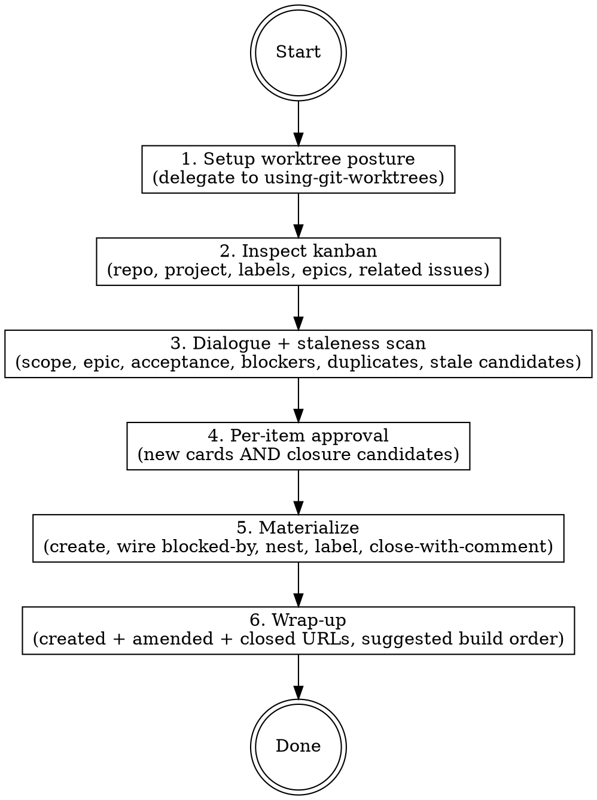

# Plan Issues

## Overview

Orchestrator skill for taking a fuzzy idea / problem domain / epic-level prompt and turning it into a structured set of GitHub issue cards on the kanban. Each card it produces is shaped to be consumed by `/build-from-issue`, which is where spec-writing, planning, and TDD happen.

**Conceptual position:**

```
fuzzy idea / problem domain
        │
        ▼
   /plan-issues          ◄── this skill
        │
        ▼ (outputs land on GitHub)
   N issue cards on the kanban
   (parent epic + labels + native blocked-by wiring)
        │
        ▼
   /build-from-issue      (one card at a time)
        │
        ▼
   brainstorming → writing-plans → TDD → PR
```

**What this skill owns:**

* Worktree isolation (forces fresh worktree off `origin/main` before any work).
* Kanban-state inspection (open epics, related issues, label taxonomy).
* Planning dialogue tuned to issue-level decisions.
* Per-card approval (creation, amendment, closure).
* GitHub materialization (issue create, blocked-by wiring, epic nesting, project attachment, closure with explanatory comments).

**What this skill explicitly does NOT do:**

* Spec writing or design docs. That belongs in `/build-from-issue`.
* Code edits. Same.
* Deletion of any GitHub artifact. Closure-with-comment only — see "Rule enforcement."
* Cross-*repo* GitHub planning. The skill operates on whatever repo is auto-detected from CWD.

**Announce at start:** "Using the plan-issues skill to plan work at the kanban-issue level."

## References

| File | Contents | When to consult |
|------|----------|-----------------|
| `../clean-up-kanban/SKILL.md` | Board-hygiene playbook: the epic-body template (product outcome + lifecycle stage + drainable execution order), three-bucket staleness review, duplicate hunt, orphan adoption, amendment/closure/batch-materialization discipline | **Read EARLY — right after Phase 1.** It owns the epic-body template Phase 5 writes, the duplicate-hunt discipline behind Phase 3 step 0, and the staleness rules the Phase 3 scan applies. |

## Delegations

* **Worktree mechanics** → `superpowers:using-git-worktrees` (which itself prefers the native `EnterWorktree` tool over `git worktree add`).
* **Library-doc lookups during planning** → `context7-mcp` whenever a proposed acceptance criterion depends on a third-party library API. For any spec section depending on a third-party library API, fetch current docs *before* drafting; don't conflate general knowledge with current specifics.
* **End-of-session worktree disposal** → `superpowers:finishing-a-development-branch` or `/clean_gone` (manual, after the session).
* **GitHub CLI / API** → `gh` for issues, project boards, labels; `gh api` for the dependencies endpoint and any beta surfaces (sub-issues).
* **User decisions** → `AskUserQuestion` for every irreversible action (epic creation, card creation, closure approval, new-label creation).

## Core rules (encoded directly — read these first)

The skill enforces these rules. They are NOT memory references — they are the actual rules:

* **No orphan issues.** Every issue created has a parent epic, OR a one-sentence justification recorded in the issue body explaining why it stands alone. The first Phase 3 question is "parent epic?" with detected candidates + "propose new" + "none (justify)". **Would-be-epic escape hatch:** when the only honest parent would be a 1-card epic (the main historical cause of orphans), do NOT create the epic — record `Would-be epic: <title>` in the card body instead; the clean-up-kanban orphan sweep promotes it to a real epic once a second member appears.
* **The epic template + hygiene rules live in `clean-up-kanban`.** Read `.claude/skills/clean-up-kanban/SKILL.md` early (it's small): §1 is the epic-body template this skill's Phase 5 MUST follow (cross-child story + **product outcome + lifecycle stage (0 POC / 1 Hardening / 2 Later) + temporally-drainable execution order**, plus the Project `Stage` field), §5 is the duplicate-hunt behind Phase 3 step 0, and §2's staleness rules drive the Phase 3 scan.
* **Issue card brevity.** Cards are bullet-based: Title + Why (1 bullet) + Acceptance (≤5 bullets, present-tense like "X is implemented and tested") + optional Out-of-scope (1 bullet) + optional Dependencies (1 bullet). No long-form narrative. Review-friendly and build-ready.
* **GH-native blocked-by enforcement.** Every blocked-by relationship is wired via the REST dependencies endpoint, not just stated in the issue body. Stating it in body text without wiring it makes it invisible to GitHub's dependency-graph UI. Verify by readback after each wire call.
* **Database ID, not issue number, for dependencies.** GitHub's dependencies API requires the integer database ID of the blocker, not the issue number. Capture it with `gh api repos/<o>/<r>/issues/<n> --jq '.id'` immediately after creating any issue.
* **Worktree for planning sessions.** Switch to a worktree off `origin/main` before epic/issue/kanban work so parallel coding agents in the main checkout aren't disturbed. If already in a worktree, verify it's clean and current.
* **Fail hard, don't warn+fallback.** Every `gh` / `gh api` exit code is checked. Failures stop the skill immediately and surface actual stderr. Subtle warn-and-continue logs get missed and silent degradation surfaces later as mysterious bugs.
* **Never delete, only close.** Remove issues by closing with an explanatory comment, never `gh issue delete` or DELETE via `gh api`. Closure preserves audit trail; deletion destroys supersession links and discussion history.
* **Fetch library docs first.** For any acceptance criterion that mentions a third-party library API, fetch current docs via `context7-mcp` before drafting that criterion. Training data may not reflect recent changes.

## Workflow



### Phase 1 — Setup worktree posture

Invoke `superpowers:using-git-worktrees` with **smart-force semantics**:

1. `git fetch origin` first. Without a fresh fetch, "current main" is whatever happens to be in the local checkout.
2. Read posture:
   * `GIT_DIR` vs `GIT_COMMON` to detect linked-worktree-ness (the using-git-worktrees skill handles this and the submodule guard).
   * Current branch name.
   * Working-tree cleanliness (`git status --porcelain`).
3. **Stay in place** only if all three hold:
   * Already in a linked worktree (not the main checkout).
   * Current `HEAD` is at `origin/main`, or is a clean ancestor of `origin/main` with no divergence.
   * Working tree is clean (no uncommitted changes).
4. **Otherwise, create a fresh worktree** via `EnterWorktree` (or the `git worktree add` fallback the using-git-worktrees skill prescribes). The new branch is created off `origin/main` and uses the default `claude/<adjective-noun-hash>` name.

Announce the final posture:

```
Planning in <worktree-path>
On branch <name> (based off origin/main@<short-hash>)
```

### Phase 2 — Inspect kanban

Auto-detect the GitHub target from CWD:

```bash
gh repo view --json nameWithOwner -q .nameWithOwner
```

Auto-detect the project board:

```bash
gh project list --owner <org> --format json
```

* If exactly one project is linked to the detected repo, use it.
* If multiple, ask the user via `AskUserQuestion` (one-pick).
* If none, ask once: "no project board found — skip project attachment, or specify a project number?"

**Labels — live-fetch once per session.** This skill does not persist a label cache. Fetch the current label set at the start of every session:

```bash
gh label list --repo <owner>/<repo> --limit 200 --json name,description,color
```

Hold the result in working memory for the duration of the session. When Phase 4 needs to offer label choices, draw from this in-memory list. If `gh label list` fails (e.g., offline), fail hard — labels are required to materialize cards correctly.

Pull current open epics. Epics in this repo are identified by the **`EPIC` label** (case-sensitive — the label is uppercase `EPIC`, not `epic`). By convention every epic also carries an `[EPIC]` title prefix and acts as a GitHub parent (sub-)issue, but the label is the canonical, queryable signal:

```bash
gh issue list --repo <owner>/<repo> --label EPIC --state open \
  --json number,title,body,labels --limit 100
```

As a safety net (in case an epic container was created before being labeled), also sweep for the title-prefix convention:

```bash
gh issue list --repo <owner>/<repo> --search "[EPIC] in:title" --state open \
  --json number,title,body,labels --limit 100
```

(Fetch `body` here too — Phase 3's staleness scan compares title **or body** overlap, so unioned-in epics must carry their bodies, matching the `--label EPIC` query above.)

**Union the two result sets (dedup by issue number) into the working open-epic inventory** that drives the Phase 2 count/listing AND the Phase 3 "parent epic?" options — an unlabeled `[EPIC]`-titled container must still be selectable as a parent this session, not vanish until its label is fixed. For any issue that appears only in the title-prefix sweep (i.e. missing the `EPIC` label), mark it `[needs EPIC label]` in the Phase 2 listing and, when the user nests a card under it (or confirms), apply the label during Phase 5 materialization (`gh issue edit <n> --add-label EPIC`) so the inventory self-heals.

Pull related-by-keyword issues using the user's planning prompt:

```bash
gh issue list --repo <owner>/<repo> \
  --search "<keywords from user's prompt>" \
  --state open --json number,title,labels --limit 50
```

Summarize back to the user in a compact form:

```
Repo: <owner>/<repo>   Project: <name> (#<number>)
<E> open epics
<R> related open issues (keyword-matched against your prompt)
```

Followed by a terse listing of epics (one line each: `#<num> <title>`) and related issues (same).

### Phase 3 — Dialogue + staleness scan

Use `AskUserQuestion` for each focused question, one at a time, multi-choice when possible:

1. **Parent epic?** Offer the detected open epics (the unioned inventory from Phase 2 — both `EPIC`-labeled and any `[EPIC]`-titled-but-unlabeled containers) + "propose a new epic" + "none (justify)". Picking "none" requires a one-sentence justification that goes into the issue body — see "No orphan issues" in Core rules.
2. **Scope shape:** single card or N decomposed cards? If N, how many roughly?
3. **Acceptance criteria** per proposed card: terse bullets, max ~5 items, written in the present tense ("X is implemented and tested"). Ask the user to validate each card's acceptance bullets before moving on.
4. **Blocked-by relationships:** for each card, which existing issues block it, and which other proposed cards block it? Capture both kinds of edges.
5. **Labels:** offer from the session's live-fetched list. If nothing fits, ask via `AskUserQuestion`: "create new label `<name>`?" If yes, `gh label create` and refresh the in-memory list. If no, drop the label or pick another.

**Staleness scan** (must run before Phase 4):

Compare proposed cards against the Phase 2 inventory and surface two sets:

* **Possible duplicates** — existing open issues whose title or body overlaps significantly with a card we're about to create. For each, suggest one of: (a) amend the existing one instead of creating a new card, or (b) close the existing one *after* creating the new card if its scope subsumes the old one.
* **Possibly stale** — existing open issues (including epics) whose stated goal is contradicted, superseded, or rendered moot by what we're planning. Name each one and explain *why* it looks stale, citing the new cards or scope shifts that conflict with it.

Chat with the user broadly about the candidate sets — no decisions yet. The user can push back, defend any issue, narrow or widen the lists. Be willing to drop candidates from the closure list if the user pushes back; err on the side of surfacing more candidates rather than missing real duplicates.

### Phase 4 — Per-item approval

Two parallel approval loops, run consecutively.

**Loop A — new-card approvals.** For each proposed card, render in the terse bullet format below and use `AskUserQuestion`:

```
[Draft] #<n> of <total>
Title: <terse title>
Parent epic: <epic title or "(new epic: <title>)" or "(none — justification: …)">
Labels: <l1>, <l2>
Blocked by: <list of issue numbers or other draft cards>

Body:
- **Why:** <one bullet>
- **Acceptance:**
  - <bullet 1>
  - <bullet 2>
  - …
- **Out of scope:** <optional one bullet>
- **Dependencies:** <optional one bullet — only when not captured by blocked-by>

Approve / Edit / Drop?
```

If "Edit," ask which field to revise and re-render. Repeat until approved or dropped.

**Loop B — closure approvals.** For each closure candidate from Phase 3's staleness scan, use `AskUserQuestion` with a Yes/No interface:

```
[Closure candidate] <repo>#<n>: <title>
URL: <url>
Reason this looks stale/duplicate: <skill's reasoning, 1–2 sentences>

Close this issue (with explanatory comment)?
```

If Yes, optionally prompt for one-line additional context the user wants in the closing comment (skill drafts a default that names the superseding card(s) and the planning session). If No, drop the candidate silently.

### Phase 5 — Materialize

Order of operations matters — do the structural pieces first, then wire dependencies, then close.

1. **Create the new epic (if any) — with the would-be-epic guard.** If the user proposed a new epic in Phase 3, first count how many cards will ACTUALLY nest under it this session: cards being created in step 2 **plus** existing issues approved for re-homing under it in this plan. **If the count is exactly one, do NOT create the epic** — apply the would-be-epic escape hatch: skip epic creation, and in step 2 include `Would-be epic: <title>` in that card's body at creation time (it stays unparented; step 4 skips it); the clean-up-kanban orphan sweep mints the epic when a second member appears. (Create a 1-member epic only on the user's explicit insistence.) **If the count is zero**, do NOT create the epic either — nothing would nest under it. Say WHY to the user, matched to the cause: members were dropped or re-homed to existing epics during approval → the epic proposal is moot this session (note it as a `Would-be epic:` on any surviving card that still wants it). For epics with ≥2 actually-nesting members, create the epic first. A new epic MUST get the `EPIC` label (the canonical discovery signal) AND an `[EPIC] ` title prefix — both, every time. **Normalize the prefix:** prepend `[EPIC] ` only if the approved title doesn't already start with it (case-insensitive), so an already-prefixed title isn't doubled into `[EPIC] [EPIC] …`:
   ```bash
   gh issue create --repo <owner>/<repo> --title "[EPIC] <epic title>" \
     --body "<epic body>" --label EPIC [--label <other>]…
   ```
   Capture both the issue number AND the database ID immediately:
   ```bash
   gh api repos/<owner>/<repo>/issues/<number> --jq '.id'
   ```
   **Write the `<epic body>` per the clean-up-kanban §1 template** — the epic body IS the cross-child map `/build-from-issue` reads for meta-context: `## Product outcome` (customer value + **lifecycle stage: 0 — POC / 1 — Hardening / 2 — Later** + drainable-vs-index posture), `## Foundation` (merged decisions children must not reopen), `## The story` (each child's one-line role + blockers + sequential/parallel execution order), `## End-state` (what "drained" observably looks like). If the Project board has a `Stage` single-select field, set it on the epic item after attaching.

2. **Create child cards.** For each approved card in Loop A (for a card under ANY step-1 would-be-epic decision — the one-member hatch OR the zero-count moot path — append `Would-be epic: <title>` to its body BEFORE this create call; for an EXISTING surviving issue on the zero-count path, append the marker via `gh issue edit` now — the marker always lands on the board, never as an afterthought):
   ```bash
   gh issue create --repo <owner>/<repo> --title "<title>" \
     --body "<body>" --label <l1> --label <l2>…
   ```
   Capture issue number and database ID for each (same `gh api … --jq '.id'` step). These IDs are needed for blocked-by wiring.

3. **Wire blocked-by** via the REST dependencies endpoint. The payload key is `issue_id`, and the value must be a JSON integer — use `-F` (typed field), not `-f` (raw string), or the API rejects with 422:
   ```bash
   gh api -X POST \
     repos/<owner>/<repo>/issues/<dependent-number>/dependencies/blocked_by \
     -F issue_id=<integer-db-id-of-blocker>
   ```
   After each call, verify by readback:
   ```bash
   gh api repos/<owner>/<repo>/issues/<dependent-number>/dependencies/blocked_by --jq '.[].id'
   ```
   Confirm the expected ID is present. **Fail hard** if not.

4. **Nest under epic — SKIP for would-be-epic cards.** A card whose approved parent decision was the would-be-epic escape hatch (its body carries `Would-be epic: <title>`) is **intentionally left unparented** — do not nest it anywhere; the clean-up-kanban orphan sweep promotes the would-be epic to a real one once a second member appears, and nests the card then. For every other card, feature-probe the sub-issues API on the first call. `sub_issue_id` is also a JSON integer — use `-F`:
   ```bash
   gh api -X POST repos/<owner>/<repo>/issues/<epic-number>/sub_issues \
     -F sub_issue_id=<child-db-id>
   ```
   If the endpoint returns 404 on the first call, silently fall back for the rest of the session: append a task-list checkbox to the epic body referencing each child issue's number, via `gh issue edit <epic-number> --body-file -`. Decide once per session.

   **Self-heal the parent's label.** If the parent epic came from the title-prefix sweep without the `EPIC` label (the `[needs EPIC label]` marker from Phase 2), apply it now so the container becomes discoverable via the canonical query:
   ```bash
   gh issue edit <epic-number> --repo <owner>/<repo> --add-label EPIC
   ```

5. **Attach to project board.** For each created issue:
   ```bash
   gh project item-add <project-number> --owner <org> --url <issue-url>
   ```

6. **Close approved-for-closure issues.** For each issue approved in Loop B:
   ```bash
   gh issue comment <n> --body "<reason + link(s) to superseding cards>"
   gh issue close <n>
   ```
   **Never** `gh issue delete` and never `DELETE /repos/.../issues/...` via `gh api`. Closure preserves the audit trail; deletion destroys it.

If `gh issue close` fails after `gh issue comment` succeeded, surface both facts: the comment is on the issue but the issue is still open. Fail hard with the stderr.

### Phase 6 — Wrap-up

Summarize three sets in compact form:

```
Created (N):
  #<n1> <title> — <url>
  #<n2> <title> — <url>
  …

Amended (M):
  #<n>  <terse description of the amendment> — <url>

Closed (K):
  #<n>  <one-line reason> — <url>

Suggested build order (topological by blocked-by):
  1. /build-from-issue <url-of-first>
  2. /build-from-issue <url-of-second>
  …
```

Worktree stays alive. Tell the user: "Worktree is at `<path>`. Run `/finishing-a-development-branch` or `/clean_gone` when you're ready to dispose of it."

## GitHub mechanics reference

Quick reference for the commands this skill runs, in the order they typically appear.

| Step | Command | Notes |
|---|---|---|
| Detect repo | `gh repo view --json nameWithOwner -q .nameWithOwner` | Uses origin remote of CWD |
| Detect projects | `gh project list --owner <org> --format json` | Filter to repo-linked; AskUserQuestion if >1 |
| Fetch labels | `gh label list --repo <r> --limit 200 --json name,description,color` | Live-fetched once per session; held in-memory only |
| Open epics | `gh issue list --repo <r> --label EPIC --state open --json number,title,body,labels --limit 100` | Label is uppercase `EPIC` (case-sensitive). Also sweep `--search "[EPIC] in:title"` to catch any unlabeled epic container. |
| Create epic | `gh issue create --repo <r> --title "[EPIC] <t>" --body <b> --label EPIC …` | New epics get BOTH the `EPIC` label and `[EPIC]` title prefix |
| Related issues | `gh issue list --repo <r> --search "<kw>" --state open --json number,title,labels --limit 50` | Keyword filter from user prompt |
| Create issue | `gh issue create --repo <r> --title <t> --body <b> --label <l>…` | Returns URL |
| Capture DB ID | `gh api repos/<o>/<r>/issues/<n> --jq '.id'` | Integer; required for dependencies API |
| Wire blocked-by | `gh api -X POST repos/<o>/<r>/issues/<n>/dependencies/blocked_by -F issue_id=<id>` | DB ID (integer), not issue number. `-F` (typed) not `-f` (string), else 422. |
| Verify blocked-by | `gh api repos/<o>/<r>/issues/<n>/dependencies/blocked_by --jq '.[].id'` | Fail hard if missing |
| Nest sub-issue | `gh api -X POST repos/<o>/<r>/issues/<epic>/sub_issues -F sub_issue_id=<id>` | Beta; `-F` for integer; fallback to task-list on 404 |
| Edit body | `gh issue edit <n> --body-file -` | For task-list fallback or twin-link update |
| Attach to project | `gh project item-add <p> --owner <o> --url <url>` | One call per issue |
| Comment | `gh issue comment <n> --body <b>` | Required precursor to close |
| Close | `gh issue close <n>` | NEVER `gh issue delete` |

## Rule enforcement map

| Rule | Phase | Mechanism |
|---|---|---|
| No orphan issues | 3 | First dialogue question is "parent epic?" with detected candidates + "propose new" + "none (justify)". "None" requires a one-sentence justification written into the issue body. |
| GH-native blocking | 5 | Every blocked-by edge is wired via the REST dependencies endpoint, not just stated in the body text. Verified by readback after each call. |
| GH dependencies use database ID | 5 | Each issue's DB ID is captured at creation (`gh api … --jq '.id'`). The dependencies API call never uses issue numbers. |
| Issue card brevity | 4 | Card template is bullet-based: title + Why + Acceptance (≤5) + optional Out-of-scope + optional Dependencies. No long-form narrative. |
| Live-fetch labels | 2 + 4 | Live `gh label list` at session start; in Phase 4, only offer items from that in-memory list. New labels go through `AskUserQuestion` + `gh label create` + in-memory refresh. |
| Worktree for planning | 1 | The skill itself IS the enforcement. Smart-force semantics described in Phase 1. |
| Fail hard, don't warn+fallback | All | Every `gh`/`gh api` exit code is checked. Failures stop the skill immediately and surface the actual stderr. |
| Fetch library docs first | 3 (conditional) | If an acceptance criterion references a third-party library API, invoke `context7-mcp` before drafting that criterion. |
| Never delete, only close | 5 | The skill has no codepath that calls `gh issue delete` or the REST DELETE endpoint. Closure pairs `gh issue comment` (reason) with `gh issue close`. |

## Edge cases & failure modes

**Fail hard, with the actual stderr surfaced.** No warn-and-continue:

* `gh` not authenticated → stop at Phase 2 with the `gh auth status` output.
* `git fetch origin` fails → stop at Phase 1.
* `gh repo view` returns nothing (not in a repo / no origin) → stop at Phase 2 with "this skill needs a GitHub-backed repo in CWD."
* `gh label list` fails → stop at Phase 2. Labels are required and there is no cache to fall back on.
* Any 4xx/5xx from the dependencies API → stop at Phase 5, report which dependency edge failed and the issue numbers involved.
* Verification readback shows expected ID missing → stop at Phase 5, same.
* `gh issue close` fails after `gh issue comment` succeeded → stop, surface both facts.

**Graceful degradation** (warn once, continue):

* Sub-issues API returns 404 on first call → silently fall back to task-list checkboxes in the epic body for the rest of the session.
* Project board count is 0 under the org → ask once: "skip project attachment, or specify a project number?"

**Partial-success reporting (Phase 5).** If issue creation succeeds but blocked-by wiring or epic-nesting fails, the issue still exists. Don't roll back — that's destructive and we don't know what the user wants. Report:

```
Created N issues, wired M of K dependencies, attached L of N to project.
Failed steps:
  - <issue #x>: <command that would re-run the failed step manually>
  …
```

Worktree stays alive; user fixes manually or re-invokes the skill on a smaller scope.

**Pre-existing-state surprises** (read once, decide once):

* User in a worktree behind `origin/main` but clean → "stay" only if `HEAD == origin/main` exactly or is a clean ancestor with no divergence. If behind, create new worktree at fresh `origin/main`; leave the old one alone.
* User in a worktree with uncommitted changes → never stay. New worktree off `origin/main`, old worktree untouched (no stash, no force).
* More than ~20 open epics surfaced in Phase 2 → keyword-filter aggressively against the user's prompt; show top 5; offer "show more" interactively.

## Out of scope

Explicit non-goals — surface these to the user if a request brushes against them, don't quietly do them:

* **Cross-repo planning** (multiple GitHub repos in one session). The skill operates on the auto-detected GitHub repo only. If the user wants issues in another GitHub repo, they should re-run the skill from that repo's checkout.
* **Deletion of any GitHub artifact.** Closure-with-comment only.
* **Effort estimation, point assignment, sprint planning.** Out of layer — those are kanban-tooling concerns, not issue-content concerns.
* **Owner / assignee assignment.** The skill can suggest, but doesn't `gh issue edit --add-assignee` without explicit `AskUserQuestion` approval per assignee.
* **Spec writing or design docs.** That belongs inside `/build-from-issue`, which has the brainstorming + writing-plans skills baked in.
* **Code edits.** Same. The planning worktree is a safe place to read and explore, not to commit feature code.

## Quick reference

| Situation | Action |
|---|---|
| Session start | Invoke `/plan-issues`. Skill handles worktree posture first. |
| Already in a clean main-based worktree | Skill stays put; announces posture. |
| On a feature branch (dirty or not) | Skill creates a fresh worktree off `origin/main` via `EnterWorktree`. |
| Multiple project boards | `AskUserQuestion` one-pick. |
| Label not in session list | `AskUserQuestion` → create or pick alternative. |
| Possible duplicate detected | Chat broadly first; per-issue Yes/No before any closure. |
| Stale issue detected | Same — Yes/No per item; closure pairs comment + close. |
| `gh` command fails | Fail hard; surface stderr. Don't silently retry or continue. |
| Sub-issues API 404 | Fall back to task-list checkboxes in the epic body. |
| User invokes mid-session (not at start) | Skill is idempotent — handles smart-force the same way. |
| End of session | Worktree stays alive. User runs `/finishing-a-development-branch` or `/clean_gone` later. |

## Red flags

**Never:**

* Call `gh issue delete` or `gh api -X DELETE /repos/.../issues/...`.
* Create an issue without a parent epic decision (epic, propose-new, or justified none).
* Wire blocked-by using issue numbers instead of database IDs.
* Skip the verification readback after wiring a dependency.
* State a blocked-by relationship in the issue body without also wiring it via the REST API.
* Use a label that's not in the session's live-fetched list without `AskUserQuestion` approval to create it.
* Auto-close an issue without per-issue user approval.
* Write a spec doc or design doc to disk — that belongs inside `/build-from-issue`.

**Always:**

* `git fetch origin` before Phase 1 posture check.
* Live-fetch labels at the start of Phase 2; hold in working memory.
* Capture the database ID immediately after creating any issue.
* Pair `gh issue comment` (reason + links) with `gh issue close` — never just close.
* Surface duplicate/stale candidates in Phase 3 chat *before* the per-item approval gate in Phase 4.
* Report partial-success state with the exact commands needed to finish manually.
* Tell the user the worktree path at the end of Phase 6 so they can dispose of it later.
