# Resolve PR Concerns

## Overview

Reactive, project-aware orchestrator that closes the loop on an open PR before it's merged. Enumerates everything pending — bugbot/automated review findings, inline human reviewer comments, dependabot or other dependency-bump PRs against the base branch, failing CI checks — classifies each item, drives it to resolution (with the user's input where needed), and ensures the latest commit gets a fresh automated review once the work is done — relying on Bugbot's auto-on-push where that's enabled (detected in Step 1a), or an explicit `bugbot run` otherwise, so the redundant comment is skipped when the push already triggers a review.

This skill exists because PRs accumulate signal from multiple sources (bots, humans, dependency systems) and shipping requires noticing and addressing all of them — silently merging while a bugbot finding sits unread is a failure mode worth a workflow guard.

**Delegations:**
- Evaluation discipline for every concern → `superpowers:receiving-code-review` (verify against codebase, no performative agreement, push back when wrong, YAGNI checks, GitHub thread replies)
- Per-fix discipline → `superpowers:test-driven-development` (RED → Verify-RED → GREEN → Verify-GREEN; iron law)
- Non-obvious root causes (CI failure that isn't lint/test, bugbot finding that's symptom not cause) → `superpowers:systematic-debugging` before patching
- Independent fixes in parallel (gated, capped at 4) → `superpowers:dispatching-parallel-agents` + `superpowers:using-git-worktrees`
- Optional pre-pass when no bots are configured → `superpowers:requesting-code-review` to dispatch a fresh reviewer subagent against the PR's SHA range
- Status-summary fresh-evidence backstop → `superpowers:verification-before-completion`

**Project-knowledge core (what this skill owns and is unique for):**
- Cursor Bugbot / Copilot / dependabot / renovate enumeration commands
- Loop guards (iteration counter, fingerprint-based oscillation detection)
- CI-failure triage: OIDC App-token / `pull_request_target` workflow trap, fork-secrets unavailability, flaky external API treatment
- `bugbot run` re-trigger as the closing step, when Bugbot is installed and enabled on the repo (see Step 1a/1b for detection and the no-bot fallback)
- `wait_for_pr_checks.sh` orchestration with terminal-state polling
- Final user-facing status summary

**Companion user-facing slash commands** (locked, user-typed only): `pr-check` skill wraps `make pr_check` (lint + tests); `run-tests` skill wraps `make tests`. This skill calls the same `make pr_check` command directly via Bash; the slash commands are equivalent manual entry points for the user.

## When to invoke

- **Always invoke after pushing a commit that opened or updated a PR.** Even if the user hasn't explicitly asked — a fresh push often draws fresh bot feedback within seconds, and you want to surface anything new before the user moves on.
- The user asks about PR status, feedback, comments, or merge-readiness.
- The user mentions a bugbot/Copilot/dependabot/renovate notification.

## Loop guards

Before entering the loop, initialise two tracking variables:

```
iteration = 0
MAX_ITERATIONS = 5
previous_concern_fingerprints = {}   # set of (source, file, line, body-hash) tuples
```

**At the top of every loop:**

1. `iteration += 1`
2. If `iteration > MAX_ITERATIONS`: stop, surface a summary of remaining concerns to the user, ask how to proceed. Do **not** attempt another autonomous fix pass.
3. After enumerating concerns, compute a fingerprint for each: `(author_login, path, line, hash(body))`. If the full set of fingerprints is identical to `previous_concern_fingerprints`, the loop is oscillating — the same issues keep resurfacing. Stop immediately and tell the user: list the stuck concerns, explain that two consecutive passes produced the same findings with no change, and ask for direction. Do **not** try to fix them again.
4. If the fingerprint set shrank (some resolved, some still present): update `previous_concern_fingerprints` to the current set and continue.

A parallel-mode iteration counts as **one** outer iteration regardless of how many bughunters were dispatched — fingerprint comparison happens at enumeration, not per-bughunter.

## Workflow

```dot
digraph resolve_pr_concerns {
    rankdir=TB;
    "Start" [shape=doublecircle];
    "Init loop guards" [shape=box];
    "Find open PR for current branch" [shape=box];
    "PR exists?" [shape=diamond];
    "Stop — nothing to do" [shape=doublecircle];
    "Bots configured on PR?" [shape=diamond];
    "Optional: superpowers:requesting-code-review\n(fresh reviewer subagent)" [shape=box];
    "Increment iteration; check max" [shape=box];
    "Max iterations hit?" [shape=diamond];
    "Surface stuck concerns → user" [shape=doublecircle];
    "Enumerate concerns" [shape=box];
    "Fingerprint concerns" [shape=box];
    "Same fingerprints as last pass?" [shape=diamond];
    "Oscillation — surface to user" [shape=doublecircle];
    "Concerns?" [shape=diamond];
    "Comment 'bugbot run' on PR" [shape=box];
    "Wait for checks (wait_for_pr_checks.sh)" [shape=box];
    "Status summary (verification-before-completion)" [shape=doublecircle];
    "Classify each concern\n(superpowers:receiving-code-review)" [shape=box];
    "Parallel-mode gate: 2-4 simple,\ndir-disjoint, bounded, no rearch?" [shape=diamond];
    "AskUserQuestion: parallel?" [shape=box];
    "Dispatch ≤4 bughunters in worktrees\n(parallel-agents + worktrees + TDD)" [shape=box];
    "Cherry-pick each bughunter commit\n(serial integration gate)" [shape=box];
    "Serial fix path:\nreceiving-code-review + TDD\n(or systematic-debugging if root cause unclear)" [shape=box];
    "Run make pr_check on integrated state" [shape=box];
    "Push (single push covers all)" [shape=box];

    "Start" -> "Init loop guards" -> "Find open PR for current branch" -> "PR exists?";
    "PR exists?" -> "Stop — nothing to do" [label="no"];
    "PR exists?" -> "Bots configured on PR?" [label="yes"];
    "Bots configured on PR?" -> "Optional: superpowers:requesting-code-review\n(fresh reviewer subagent)" [label="no"];
    "Bots configured on PR?" -> "Increment iteration; check max" [label="yes"];
    "Optional: superpowers:requesting-code-review\n(fresh reviewer subagent)" -> "Increment iteration; check max";
    "Increment iteration; check max" -> "Max iterations hit?";
    "Max iterations hit?" -> "Surface stuck concerns → user" [label="yes"];
    "Max iterations hit?" -> "Enumerate concerns" [label="no"];
    "Enumerate concerns" -> "Fingerprint concerns" -> "Same fingerprints as last pass?";
    "Same fingerprints as last pass?" -> "Oscillation — surface to user" [label="yes"];
    "Same fingerprints as last pass?" -> "Concerns?" [label="no"];
    "Concerns?" -> "Comment 'bugbot run' on PR" [label="none"];
    "Comment 'bugbot run' on PR" -> "Wait for checks (wait_for_pr_checks.sh)" -> "Status summary (verification-before-completion)";
    "Concerns?" -> "Classify each concern\n(superpowers:receiving-code-review)" [label="some"];
    "Classify each concern\n(superpowers:receiving-code-review)" -> "Parallel-mode gate: 2-4 simple,\ndir-disjoint, bounded, no rearch?";
    "Parallel-mode gate: 2-4 simple,\ndir-disjoint, bounded, no rearch?" -> "AskUserQuestion: parallel?" [label="yes"];
    "Parallel-mode gate: 2-4 simple,\ndir-disjoint, bounded, no rearch?" -> "Serial fix path:\nreceiving-code-review + TDD\n(or systematic-debugging if root cause unclear)" [label="no"];
    "AskUserQuestion: parallel?" -> "Dispatch ≤4 bughunters in worktrees\n(parallel-agents + worktrees + TDD)" [label="confirmed"];
    "AskUserQuestion: parallel?" -> "Serial fix path:\nreceiving-code-review + TDD\n(or systematic-debugging if root cause unclear)" [label="declined"];
    "Dispatch ≤4 bughunters in worktrees\n(parallel-agents + worktrees + TDD)" -> "Cherry-pick each bughunter commit\n(serial integration gate)";
    "Cherry-pick each bughunter commit\n(serial integration gate)" -> "Run make pr_check on integrated state";
    "Serial fix path:\nreceiving-code-review + TDD\n(or systematic-debugging if root cause unclear)" -> "Run make pr_check on integrated state";
    "Run make pr_check on integrated state" -> "Push (single push covers all)";
    "Push (single push covers all)" -> "Find open PR for current branch";
}
```



## Step 1: Find the open PR for the current branch

```bash
git branch --show-current
gh pr list --head <branch> --state open --json number,url,title,headRefName
```

If no PR is open, stop — nothing to do.

If multiple PRs are open from this branch (rare): work the most recently updated one and tell the user.

### Step 1a. Detect Bugbot trigger mode — decide whether `bugbot run` comments are needed

Cursor Bugbot's trigger mode is a per-repo Cursor setting: **auto-on-push** (reviews every push automatically) or **manual** (reviews only on a `bugbot run` / `cursor review` comment). When auto-on-push is enabled, commenting `bugbot run` after each push is a **redundant double-trigger** — skip it.

At PR start, determine the mode once and **flag it for the session** (e.g. note `BUGBOT_AUTORUN=enabled|manual|absent`):

```bash
# Is a "Cursor Bugbot" check present on the PR, and did the latest push get a
# review without a `bugbot run` comment triggering it?
gh pr checks <num> --repo <owner>/<repo> --json name,bucket | jq -r '.[] | select(.name|test("Cursor Bugbot")) | .name + " " + .bucket'
gh pr view <num> --repo <owner>/<repo> --json reviews \
  --jq '[.reviews[] | select(.author.login=="cursor")] | last | (.body|capture("for commit (?<c>[0-9a-f]{7})").c)'
gh api repos/<owner>/<repo>/issues/<num>/comments --jq '[.[] | select(.body|test("^bugbot run"))] | length'
```

- If a `Cursor Bugbot` check exists / a recent push got a `cursor` review whose commit was **not** preceded by a `bugbot run` comment → **auto-on-push** → set `BUGBOT_AUTORUN=enabled` and **skip** the explicit `bugbot run` step (Step 5) for the rest of the session; after each push, just wait for the auto-review.
- If Bugbot reviews only ever appear right after a `bugbot run` comment → **manual** → keep using `bugbot run`.
- If no `Cursor Bugbot` check ever appears and no review lands → Bugbot may not be installed/enabled (see Step 1b).

Surface the detected mode to the user in one line ("Bugbot auto-runs on push here — I won't post redundant `bugbot run` comments").

### Step 1b (optional). Pre-pass code review when no bots are configured

If the repo has no automated PR reviewers configured (no Cursor Bugbot, no Copilot review, no equivalent), invoke `superpowers:requesting-code-review` to dispatch a fresh reviewer subagent against the PR's SHA range before enumerating. Detect this per repo — don't assume bot review is configured; a freshly bootstrapped repo typically has none until Bugbot/Copilot are explicitly installed and enabled.

## Step 2: Enumerate concerns

Pull every signal that could block merge:

### 2a. Top-level reviews (bot summaries)

```bash
gh pr view <num> --repo <owner>/<repo> --json reviews
```

Look at each review's `author.login` and `body`. Bugbot, Copilot, and similar bots leave a top-level summary review.

### 2b. Inline review comments

```bash
gh api repos/<owner>/<repo>/pulls/<num>/comments \
  --jq '.[] | {author: .user.login, body: .body, path: .path, line: .line, commit: .commit_id}'
```

These are the file/line-anchored findings — bugbot puts its specific bug reports here, and human reviewers leave their comments here too.

### 2c. Issue-style PR comments

```bash
gh pr view <num> --repo <owner>/<repo> --json comments
```

(Distinct from review comments; usually freeform discussion.)

### 2d. Failing CI checks

```bash
gh pr checks <num> --repo <owner>/<repo>
```

For every check that failed, pull the failed-step logs:

```bash
gh run view <run-id> --repo <owner>/<repo> --log-failed
```

Read the actual error. Common categories:

- **Code-level failure** (lint, tests, mypy, coverage) — fix the code; re-run `make pr_check` locally before pushing (same command surfaced by the `pr-check` skill).
- **Infrastructure / token / permission failure** — read carefully; the fix is rarely "edit code." Two common patterns to know:
  - **`pull_request_target` / OIDC App-token validation**: GitHub Actions refuses to mint a privileged App token for a workflow whose file diverges from the version on the default branch (the `claude-code-review` and `claude` actions both do this). If a workflow-file change is the cause, **revert it from the PR** and land that workflow change directly on the default branch in a separate, fast-merge PR. Surface this clearly to the user — they'll need to merge the workflow change first.
  - **Secrets unavailable on fork PRs**: forks can't read secrets; this isn't fixable from the PR side and is the user's call to override.
- **Flaky external API** (live e2e against Anthropic, etc.) — re-run the failing job once; if it fails again, treat as a real failure.

Do **not** hand-wave a CI failure as "probably fine" — every red check needs either (a) a fix landing in this PR, or (b) an explicit acknowledgement to the user that it's expected/unfixable here. If a code-level CI failure has a non-obvious root cause, invoke `superpowers:systematic-debugging` before patching.

### 2e. Dependency PRs

```bash
gh pr list --repo <owner>/<repo> --state open --json number,title,author,headRefName \
  --jq '.[] | select(.author.login | contains("dependabot") or contains("renovate"))'
```

For each, inspect the diff:

```bash
gh pr diff <num> --repo <owner>/<repo>
```

These don't block your PR directly, but folding small mechanical bumps in is often easier than carrying parallel PRs.

### 2f. Branch behind base — GATING, never optional

```bash
gh pr view <num> --repo <owner>/<repo> --json mergeStateStatus,baseRefName
```

**A branch that is behind its base is a blocking concern, not an FYI.** If `mergeStateStatus` is `BEHIND` (or the branch otherwise lacks the latest base commits), you MUST update it before the PR can be called merge-ready — CI and bot reviews on a stale branch verify code that isn't what will actually land. Do **not** describe this as "optional," "at your discretion," or "the merge button can handle it."

Resolve it like any other concern:

```bash
git fetch origin <base>
git merge origin/<base> --no-edit     # resolve conflicts if any
<project pre-merge checks>            # re-verify the MERGED state locally (e.g. make pr_check)
git push
```

Then **loop back** — the push re-runs CI and you re-trigger the automated reviewer (Step 5) so the green checks + clean review reflect the post-merge state. Only a branch current with its base (`mergeStateStatus` not `BEHIND`) and green **on that merged state** is merge-ready. If a merge conflict needs human judgment, surface it; otherwise resolve it yourself.

## Step 3: Classify each concern (with `superpowers:receiving-code-review` discipline)

**Every concern** — simple or complex — gets the `superpowers:receiving-code-review` evaluation pass before it's actioned. That skill governs:

- Verifying the suggestion against the codebase before implementing (e.g., is the "duplicate entry" actually duplicate, or load-bearing?).
- YAGNI check on "implement properly" suggestions (grep for actual usage).
- Pushing back with technical reasoning when the reviewer is wrong (rather than performative agreement).
- No "thanks", no "great point" — state the fix or push back.
- Replying to inline review comments via the comment thread (`gh api repos/{owner}/{repo}/pulls/{pr}/comments/{id}/replies`), not as a top-level PR comment.

**After applying that discipline**, classify each concern as **simple** or **complex**:

**Simple** = mechanical, scope-clear, low-judgment, verified against codebase. Heads-up to the user (one short sentence), apply the fix, move on.

Examples:
- "Duplicate entry in this list — verified, removing it"
- "Typo in this docstring — verified not load-bearing, fixing it"
- "actions/checkout 4→6 — diff is mechanical, applying"
- "Loop variable shadows outer name — renaming inner one"
- A bugbot finding with a clear, isolated patch and confidence-level high

**Complex** = needs a judgment call, the user might disagree with the proposed fix, or the issue surfaces a design question. **Use `AskUserQuestion`** to interview before acting.

Examples:
- "Reviewer suggests refactoring this module — proposes splitting into two; depends on user's intended boundary"
- "Bugbot flags a race condition — fix could be a lock, a redesign, or 'won't fix'"
- "Dependency bump that could break runtime behavior (major-version, or large diff)"
- A reviewer's comment that disagrees with the design intent of the PR

When in doubt: prefer asking. The cost of an extra question is small; the cost of silently choosing a direction the user disagrees with is large.

If `receiving-code-review` discipline reveals that a "concern" is actually wrong (reviewer lacked context, suggestion would break things, YAGNI), **push back in the PR thread with technical reasoning** rather than implementing. Mark it resolved-by-pushback in the status summary.

## Step 4: Apply the fixes — choose serial or parallel mode

Both modes use TDD via `superpowers:test-driven-development` (RED → Verify-RED → GREEN → Verify-GREEN). Both run `make pr_check` (= `make lint` + `make tests`; same command surfaced by the `pr-check` skill) before considering work done. The choice is purely about whether independent concerns get fanned out to bughunter agents or fixed sequentially in this session.

### 4a. Parallel-mode gate

Enter parallel mode **only if all of these are true**:

| Criterion | Reason |
|---|---|
| **2–4 concerns** (cap = 4) | Below 2: nothing to parallelize. Above 4: orchestration overhead and cherry-pick juggling exceed savings. The cap is a conservative starting point; revisit upward once the cap proves comfortable in practice. |
| All concerns classified `simple` (Step 3) | `complex` concerns need per-concern user alignment — bughunter agents work autonomously and can't pause to ask. |
| Concerns are **directory-disjoint** (not just file-disjoint) | Sibling files in the same module often share imports / fixtures / `conftest.py`. Directory-level disjointness is the safer gate. If any two concerns share a directory, fall back to serial for those. |
| Each fix scope is **bounded** (heuristic: < 30 lines of expected diff, single file or 2 closely-related files per concern) | Big changes are atomic units anyway; parallelization gives nothing and risks more collision. |
| No concern requires re-architecting | Bughunter agents have narrow scope; refactors need a planning phase. |

If the gate passes, use `AskUserQuestion` to confirm before dispatching:

> "I plan to fix N concerns in parallel via worktrees. Concerns: [list with one-line summaries]. Each will be fixed in its own worktree by a separate bughunter agent; I'll cherry-pick the results back into the PR branch as atomic per-concern commits and do a single push. Proceed, or fall back to serial?"

If any criterion fails, or the user declines, fall back to serial (Step 4c).

### 4b. Parallel-mode dispatch (when gate passes + user confirms)

Use `superpowers:dispatching-parallel-agents` with `superpowers:using-git-worktrees` for isolation:

1. **Spin up worktrees**: one per bughunter, each branched off the current PR HEAD. Use `superpowers:using-git-worktrees`.
2. **Dispatch ≤4 bughunters concurrently** (single message with multiple Agent calls). Each bughunter gets:
   - Specific scope: one concern, with full context (the bot's exact comment, file paths, line numbers, any related code excerpts).
   - Constraints: "Only edit files within `<assigned-directory>`. Use `superpowers:test-driven-development` (RED → Verify-RED → GREEN → Verify-GREEN). Run `make pr_check` in your worktree before reporting back. Commit your fix in the worktree with a focused message referencing the concern. **Do not push.** Report back: commit SHA + one-paragraph summary of root cause and fix."
   - Worktree path so the bughunter knows where to operate.
3. **Collect results**. Each bughunter reports a commit SHA in its worktree branch.
4. **Serial integration gate (orchestrator-owned)**:
   - Cherry-pick each bughunter's commit onto the PR branch in the order they reported back. Each lands as its own atomic commit (no squashing — preserves per-concern granularity).
   - If a cherry-pick conflicts: directory-disjoint check missed something. Abort just that cherry-pick, drop that concern from the parallel batch, surface to user, fall back to serial for that concern.
   - Run `make pr_check` once on the fully integrated state.
   - If `pr_check` fails on the integrated state but passed in each worktree, hidden coupling is the cause. Reset the integration (revert the cherry-picks), surface to user, fall back to serial for the affected concerns. Invoke `superpowers:systematic-debugging` to find the coupling.
5. **Single `git push`** covers all parallel work.
6. **Clean up worktrees** via `superpowers:using-git-worktrees` cleanup conventions (don't remove harness-owned worktrees).

### 4c. Serial-mode fixing (default fallback)

For each concern, in order:

1. Apply `superpowers:test-driven-development` discipline: write a failing test capturing the bug or expected behavior, watch it fail for the right reason, write the minimal fix, watch it pass.
2. If the root cause is non-obvious (CI failure that isn't lint/test, bugbot finding that's a symptom not the cause, behavior that contradicts your reading of the code), invoke `superpowers:systematic-debugging` before patching.
3. Run `make pr_check` after each fix. Commit with a focused message referencing the source (bot, bug ID, dependabot PR number).
4. Group related fixes into a single commit when they're truly related; keep unrelated fixes in separate commits.

After all serial fixes land, run `make pr_check` once more on the full set, then push.

## Step 5: Ensure a fresh review of the latest commit

After all concerns are resolved and pushed, Cursor Bugbot must re-review the latest commit — silently relying on the previous review is unsafe; new fixes can introduce new issues. **How** depends on the trigger mode detected in Step 1a:

- **`BUGBOT_AUTORUN=enabled` (auto-on-push):** the push you just made already triggered a fresh review. **Do NOT comment `bugbot run`** — it's a redundant double-trigger. Just proceed to Step 6 and wait for the auto-review to land.
- **`BUGBOT_AUTORUN=manual`:** comment `bugbot run` so Bugbot re-reviews against the latest commit:

  ```bash
  gh pr comment <num> --repo <owner>/<repo> --body "bugbot run"
  ```

- **`BUGBOT_AUTORUN=absent`** (no Bugbot installed/enabled): there's nothing to re-trigger; rely on the Step 1b pre-pass review instead, and tell the user Bugbot isn't enabled on the repo.

## Step 6: Wait for every check to settle

A PR isn't done while CI or bot reviews are still pending. Use the bundled helper:

```bash
bash <skill-dir>/scripts/wait_for_pr_checks.sh <pr-number> <owner>/<repo>
```

It polls `gh pr checks` until every required check has reached a terminal state (pass / fail / cancel / skipping). External bot reviews (Cursor Bugbot, Copilot, etc.) are treated as "soft pending" — the helper waits up to ten minutes for them, then surfaces them as `no-review` rather than blocking forever. Exit codes:

- `0` — all required checks passed; the PR is mergeable from a CI standpoint.
- `1` — one or more checks failed/cancelled; loop back to Step 2 and treat the failure as a new concern.
- `2` — timed out (default 20 minutes). Surface to the user; they decide whether to wait longer or investigate.

If new bot findings landed during the wait, loop back to Step 1 and address them. Only when this helper exits 0 **and** there are no new comments to address is the job done.

## Step 7: Tell the user where things stand (with `superpowers:verification-before-completion`)

Before producing the status summary, **run fresh verification commands** and read the output. No "all addressed" claim without fresh evidence — `superpowers:verification-before-completion` applies.

```bash
gh pr view <num> --repo <owner>/<repo> --json reviews,comments,mergeable,mergeStateStatus
gh pr checks <num> --repo <owner>/<repo>
```

End with a short status summary:
- What was addressed (one bullet per concern, with the source — bugbot/reviewer/dependabot — and whether it was fixed, pushed back on, or closed as YAGNI).
- What's still outstanding (if anything).
- Whether `bugbot run` was triggered and what to expect next.
- Current `mergeStateStatus` from the fresh `gh pr view` call. **Never call a PR merge-ready while `mergeStateStatus` is `BEHIND`** — that's an unresolved gating concern (Step 2f), not a footnote. "Green checks but behind base" means CI verified stale code; update the branch and re-verify first.

## Red flags — stop and reassess

- Describing a `BEHIND` branch as merge-ready, or framing "update the branch from base" as optional / the merger's call — it is a **gating** Step-2f concern: merge base in, re-run CI + the automated reviewer on the merged state, then re-assess.
- A concern shows up in a category you don't recognize (e.g. a third-party SAST bot you haven't seen) — surface it to the user, don't auto-classify.
- The fix would conflict with the user's stated intent in the PR description — ask before changing direction.
- Tests pass after a fix but the fix doesn't actually address the reviewer's concern (you treated the symptom, not the cause).
- Performative agreement ("Thanks for catching this!", "You're absolutely right!") is being drafted — `superpowers:receiving-code-review` forbids this; state the fix or push back instead.
- About to dispatch parallel bughunters for `complex` concerns — they need user alignment per concern, not autonomous fixing.
- About to dispatch parallel bughunters whose concerns share a directory — directory-level disjointness is the gate, not file-level. Fall back to serial.
- About to let bughunters push their own work — orchestrator owns the single serial push as the integration gate.
- About to squash parallel commits at integration — cherry-pick preserves per-concern atomicity that justified parallelizing in the first place.
- About to claim "all addressed" without fresh `gh pr view` / `gh pr checks` output — `superpowers:verification-before-completion` violation.

## Common mistakes

| Mistake | Fix |
|---------|-----|
| Treating every concern as simple → aggressive auto-fixes diverging from user intent | Default to AskUserQuestion when there's any judgment involved; apply `superpowers:receiving-code-review` discipline first |
| Implementing reviewer suggestions without verifying they're correct for the codebase | Wrap every concern in `superpowers:receiving-code-review`'s verify-before-implement pass — including the "simple" ones |
| Skipping `bugbot run` re-trigger after fixes, when Bugbot is actually enabled in manual mode | It's the last step in that case — never skip; new code → new review |
| Folding in a major-version dependency bump without checking the diff | Always run `gh pr diff` before applying a dep PR locally |
| Treating a red CI check as "noise" without reading the log | Run `gh run view --log-failed` on every failure; classify infra vs code; fix or escalate |
| Bumping a workflow file that uses OIDC → App token (claude-code-review, claude) inside a PR | Revert that workflow change from the PR; ask the user to land it on the default branch directly |
| Forgetting to re-enumerate after pushing | New pushes draw new bot reviews; loop back to Step 1 |
| "I addressed all the comments" without actually pushing | Verify `git status` is clean and the remote has the new commits before declaring done |
| Looping forever on non-deterministic LLM reviewer feedback | Check fingerprints each pass; identical findings two passes in a row → stop and surface, never re-fix |
| Silently grinding through all 5 iterations without telling the user | On iteration 5, surface remaining concerns and ask for direction before doing anything else |
| Inlining TDD steps in the fix path | Reference `superpowers:test-driven-development` instead — the iron law and verify-RED/GREEN gates live there |
| Dispatching ≥5 bughunters in parallel "just this once" | Cap is 4; fall back to serial above that. Revisit the cap later once empirically validated. |
| Bughunter pushes its own commit instead of reporting back the SHA | Constrain bughunter prompts: "commit in worktree, do not push, report SHA back" |
| Squashing all bughunter commits into one PR commit | Cherry-pick each separately to preserve atomicity — that's the point of fanning out |
| Final status claim without fresh `gh pr view` evidence | Run the verification commands in Step 7 immediately before drafting the summary |
